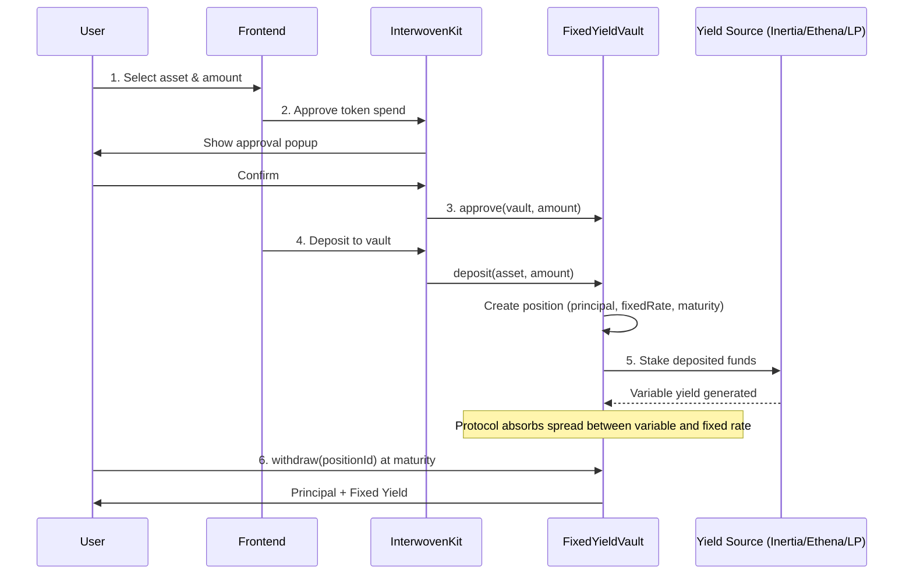
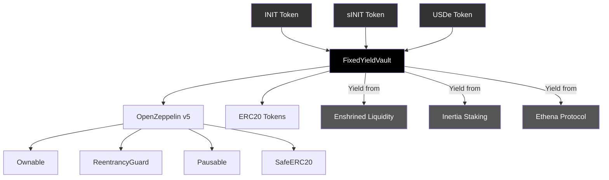

<p align="center">
  
</p>

<h1 align="center">Leticia</h1>

<p align="center">
  Fixed yield protocol on Initia — deposit yield-bearing assets and earn guaranteed fixed returns, powered by native Initia ecosystem yield sources.
</p>

<p align="center">
  <a href="https://github.com/0xpochita/Leticia/blob/main/.initia/submission.json"><strong>Submission Metadata</strong></a>
</p>

---

Leticia is a fixed yield tokenization protocol (inspired by Pendle/FIVA) built as an Initia EVM appchain for the INITIATE: The Initia Hackathon. Users deposit yield-bearing assets and receive a guaranteed fixed return — the protocol handles all complexity behind the scenes.

---

## What Makes Leticia Special

---

### Who This Is For

Meet Dani. She holds sINIT from liquid staking and INIT-USDC LP tokens from Enshrined Liquidity. She earns variable yield — some weeks 12%, other weeks 5%. She never knows what she will actually earn by the end of the quarter.

She wants predictable income. She wants to know exactly how much she will earn before she commits. But there is no protocol on Initia that lets her lock in a fixed rate on her yield-bearing assets.

Dani does not want to trade PT/YT tokens on a complex AMM. She does not want to provide liquidity or manage leveraged positions. She just wants to deposit and earn a guaranteed return.

Leticia solves this. Deposit your asset, see your fixed rate, and know exactly what you earn at maturity. One click. No complexity.

---

### The Problem

Yield in DeFi is unpredictable. Users holding yield-bearing assets on Initia face:

- **Variable rates** — staking rewards and LP yields fluctuate daily, making financial planning impossible
- **No fixed-rate option** — there is no protocol on Initia that offers guaranteed fixed returns on native assets
- **Complexity barrier** — existing yield tokenization protocols (Pendle-style) require understanding PT/YT tokens, AMM curves, and leverage — too complex for most users
- **Fragmented yield sources** — yield from Enshrined Liquidity, liquid staking (Inertia), and stablecoin protocols (Ethena) are scattered across different platforms

**How might we build a protocol where users earn guaranteed fixed yield from Initia-native sources, with zero complexity?**

---

### The Solution

Leticia solves this with a vault-based fixed yield architecture:

**1. One-Click Deposit** — Users deposit tokens (INIT, sINIT, USDe) into the FixedYieldVault smart contract. The protocol assigns a fixed rate and maturity date at deposit time.

**2. Transparent Yield Sources** — Every fixed rate is backed by real yield from Initia-native protocols:
- **INIT** → Enshrined Liquidity LP staking rewards
- **sINIT** → Inertia liquid staking rewards
- **USDe** → Ethena delta-neutral yield strategy

**3. Fixed Rate Lock-in** — The vault locks the current market rate as your guaranteed return. Regardless of how rates fluctuate after your deposit, your yield is fixed.

**4. Maturity Redemption** — At maturity, withdraw your full principal plus earned yield. Early withdrawal is possible with a small penalty (5%).

**5. Protocol-Managed Strategy** — The vault handles all yield generation behind the scenes — staking, compounding, and rebalancing — so users never need to manage positions manually.

---

## Features

- **Earn Fixed Yield**: Deposit assets and earn guaranteed fixed returns at maturity
- **Multiple Assets**: Support for INIT, sINIT (Inertia), and USDe (Ethena)
- **Transparent Sources**: Every yield rate is backed by real Initia-native protocol yield
- **One-Click Deposit**: Simple deposit flow with InterwovenKit wallet popup
- **Portfolio Tracking**: Real-time view of all active positions, earned yield, and maturity status
- **Testnet Faucet**: Mint test tokens to try the protocol
- **Early Withdrawal**: Exit before maturity with a 5% penalty
- **Multi-Vault Architecture**: Each asset has its own vault configuration with independent rate, duration, and cap

---

## Tech Stack

| Layer | Technology |
|---|---|
| Frontend | Next.js 16, React 19, TypeScript, Tailwind CSS 4 |
| Wallet | InterwovenKit (Privy wallet connector) |
| Blockchain | Initia EVM Rollup (leticia-rollup-7) |
| Smart Contracts | Solidity 0.8.26, Foundry, OpenZeppelin v5 |
| Contract Libraries | OpenZeppelin (Ownable, ReentrancyGuard, Pausable, SafeERC20) |
| EVM Integration | wagmi, viem |
| Animation | Framer Motion, GSAP |

---

## Architecture

### System Flow



### Contract Architecture



### Yield Source Mapping

```
User deposits INIT
├── Vault locks 10% fixed APR for 90 days
├── Protocol stakes INIT into Enshrined Liquidity pools
├── Variable LP rewards generated (~8-15% APR)
└── Spread (variable - fixed) = protocol margin

User deposits sINIT
├── Vault locks 15% fixed APR for 90 days
├── Protocol holds sINIT which accrues staking yield via Inertia
├── Variable staking rewards generated (~10-18% APR)
└── Spread = protocol margin

User deposits USDe
├── Vault locks 7% fixed APR for 180 days
├── Protocol deposits into Ethena sUSDe vaults
├── Delta-neutral yield generated (~5-12% APR)
└── Spread = protocol margin
```

---

## Project Structure

```
Leticia/
├── frontend/                          # Next.js frontend application
│   ├── src/
│   │   ├── app/                       # Next.js routes (earn, portfolio, faucet)
│   │   ├── components/                # UI components
│   │   │   ├── pages/(app)/           # Page components (earn, portfolio, faucet)
│   │   │   ├── pages/(landing)/       # Landing page sections
│   │   │   ├── providers/             # InterwovenKit provider
│   │   │   └── ui/                    # Shared UI components
│   │   ├── config/                    # Network & contract config
│   │   └── lib/                       # Utilities
│   └── public/                        # Static assets
├── contracts/                         # Foundry smart contracts
│   ├── src/
│   │   ├── FixedYieldVault.sol        # Core vault contract
│   │   ├── interfaces/
│   │   │   └── IFixedYieldVault.sol   # Vault interface
│   │   └── mocks/
│   │       └── MockERC20.sol          # Test tokens
│   ├── test/
│   │   └── FixedYieldVault.t.sol      # 16 tests (unit + fuzz)
│   ├── script/
│   │   └── Deploy.s.sol              # Deployment script
│   ├── foundry.toml                   # Foundry config
│   └── remappings.txt                 # Import remappings
└── .initia/
    └── submission.json                # Hackathon submission metadata
```

---

## Smart Contract Details

### Contract Addresses (Leticia Rollup)

| Contract | Address | Description |
|---|---|---|
| FixedYieldVault | `0x9fA35B449D0363893B6Fcb6781C82c817f4A0bED` | Core vault — deposit, withdraw, position management |
| INIT Token | `0x7BA4453802bA28D6EaC9117E32EC67FDFC7E6f90` | Mock INIT token (testnet) |
| sINIT Token | `0x668188d659dCa10adb4c69fB86Ae877414deA30E` | Mock sINIT token (testnet) |
| USDe Token | `0xc4762d119A39b943921bF4777EFe39BF373F7c15` | Mock USDe token (testnet) |

### Key Solidity Functions

#### FixedYieldVault

```
configureVault(asset, fixedRate, duration, cap) — Configure vault for an asset
deposit(asset, amount) → positionId            — Deposit and create fixed yield position
withdrawByAsset(asset, positionId) → payout    — Withdraw at maturity (principal + yield)
withdraw(positionId) → payout                  — Withdraw with auto asset detection
fundVault(asset, amount)                       — Fund vault with yield reserves (owner)
getUserPositions(user) → Position[]            — Get all positions for a user
getVaultConfig(asset) → (rate, duration, ...)  — Get vault configuration for an asset
calculateYield(principal, rate, start, end)    — Calculate fixed yield amount
```

### Vault Configuration

| Asset | Fixed APR | Duration | Yield Source |
|---|---|---|---|
| INIT | 10% | 90 days | Enshrined Liquidity LP Rewards |
| sINIT | 15% | 90 days | Inertia Liquid Staking Rewards |
| USDe | 7% | 180 days | Ethena Delta-Neutral Strategy |

## Setup

### Smart Contract Setup

```bash
# Install Foundry
curl -L https://foundry.paradigm.xyz | bash
foundryup

# Clone the repository
git clone https://github.com/0xpochita/Leticia.git
cd Leticia/contracts

# Install dependencies
forge install

# Build
forge build

# Run tests
forge test -v
```

### Frontend Setup

```bash
cd Leticia/frontend

# Install dependencies
pnpm install

# Start development server
pnpm dev
```

Open [http://localhost:3000](http://localhost:3000) in your browser.

### Rollup Requirements

The app connects to a local Initia EVM rollup. Ensure `minitiad` and `opinitd` are running:

| Service | Endpoint |
|---|---|
| RPC | `http://localhost:26657` |
| REST | `http://localhost:1317` |
| JSON-RPC (EVM) | `http://localhost:8545` |

---

## How It Works

### User Flow

```
Visit App → Connect Wallet → Mint Test Tokens (Faucet) → Deposit → Earn Fixed Yield → Withdraw at Maturity
```

1. **Connect Wallet** — connect via InterwovenKit wallet popup
2. **Get Test Tokens** — visit Faucet page to mint 1,000 INIT/sINIT/USDe per click
3. **Choose Asset** — browse available assets with their fixed APR and yield source
4. **Deposit** — enter amount, review yield source details, approve and deposit via wallet popup
5. **Track Portfolio** — view active positions, earned yield, and maturity countdown
6. **Withdraw** — collect principal + fixed yield at maturity, or withdraw early with 5% penalty

### On-Chain Flow

```
User                        FixedYieldVault                  Yield Source
  │                              │                              │
  ├── approve(vault, amount) ──►│                              │
  ├── deposit(asset, amount) ──►│                              │
  │                              ├── Create Position            │
  │                              │   (principal, rate, maturity)│
  │                              ├── Stake to yield source ───►│
  │                              │                              ├── Generate variable yield
  │                              │◄── Yield accrues ───────────┤
  │                              │                              │
  │  [At Maturity]               │                              │
  ├── withdraw(positionId) ────►│                              │
  │◄── principal + fixedYield ──┤                              │
```

---

## Deployment Checklist

- [x] Initia EVM rollup running (leticia-rollup-7)
- [x] FixedYieldVault smart contract deployed
- [x] MockERC20 tokens deployed (INIT, sINIT, USDe)
- [x] Vault configured with rates, durations, and caps
- [x] Vault funded with yield reserves (100,000 per token)
- [x] Frontend — Earn Fixed Yield page with real contract integration
- [x] Frontend — Portfolio page with live position tracking
- [x] Frontend — Faucet page for testnet token minting
- [x] Frontend — InterwovenKit wallet integration
- [x] Frontend — Landing page with yield source explanation
- [x] Foundry test suite (16 tests passing)
- [x] Submission metadata (.initia/submission.json)

---

## Hackathon Submission

| | |
|---|---|
| **Event** | INITIATE: The Initia Hackathon |
| **Rollup** | leticia-rollup-7 |
| **VM** | EVM (Solidity) |
| **Contract** | `0x9fA35B449D0363893B6Fcb6781C82c817f4A0bED` |
| **Initia Scan** | [View on Initia Scan](https://scan.testnet.initia.xyz/leticia-rollup-7) |

---

## Team

| Name | Role |
|---|---|
| **Alven Tendrawan** | Smart Contract Developer |
| **Oktavianus Bima Jadiva** | Frontend Developer |
| **Natalie Neysa Jessica Soesanto** | Editor / Designer |

---

## License

MIT

---

> Guaranteed yield, zero complexity — Leticia
